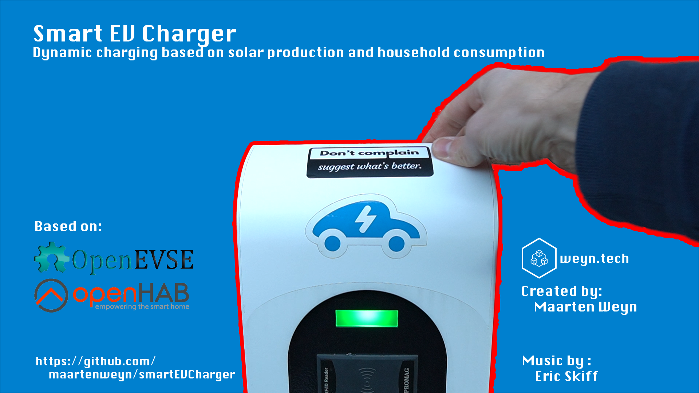
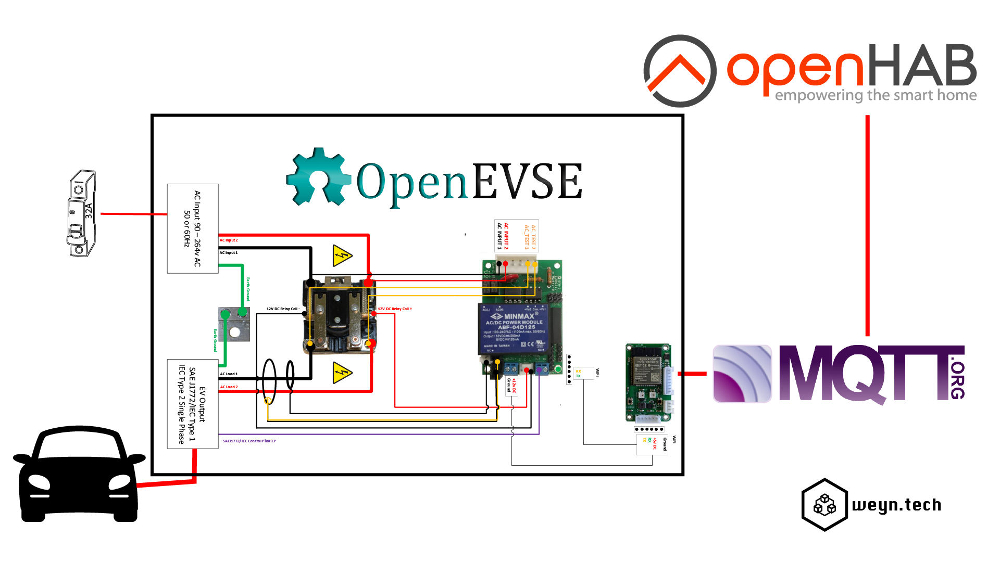
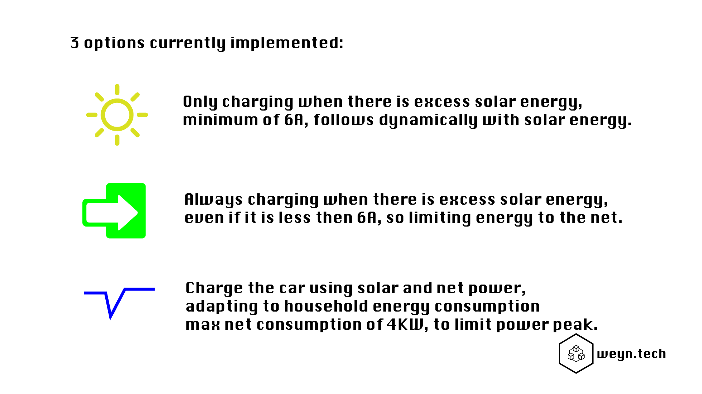

# SmartEVCharger

This repo contains some of the code snippets for [OpenHAB](https://www.openhab.org/) to link with an EV Charger based on [OpenEVSE](https://www.openevse.com/).

It monitors the energy taken from or delivered to the net using a ZWave Aeotec energy meter or an EM24 carlo gavazzi (or any other energy meter) to monitor the energy consumption and control the OpenEVSE using MQTT.

Current options implemented:

More info on [Youtube](https://youtu.be/_YUrnYUuvRo).

